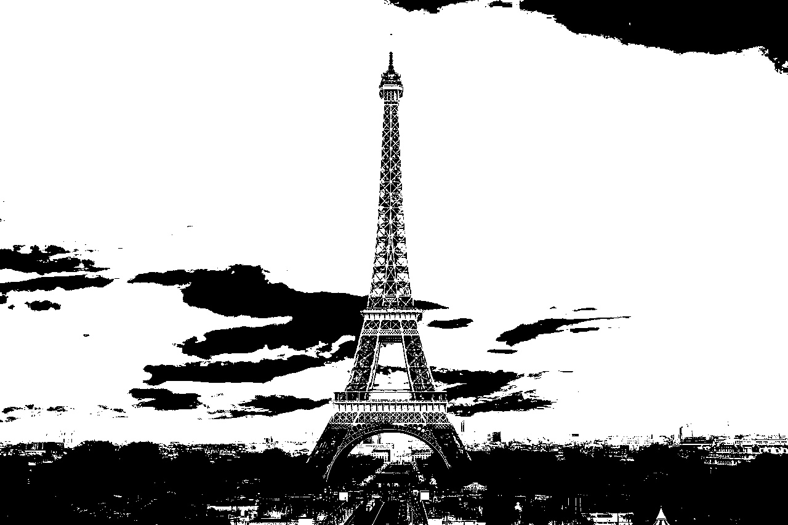
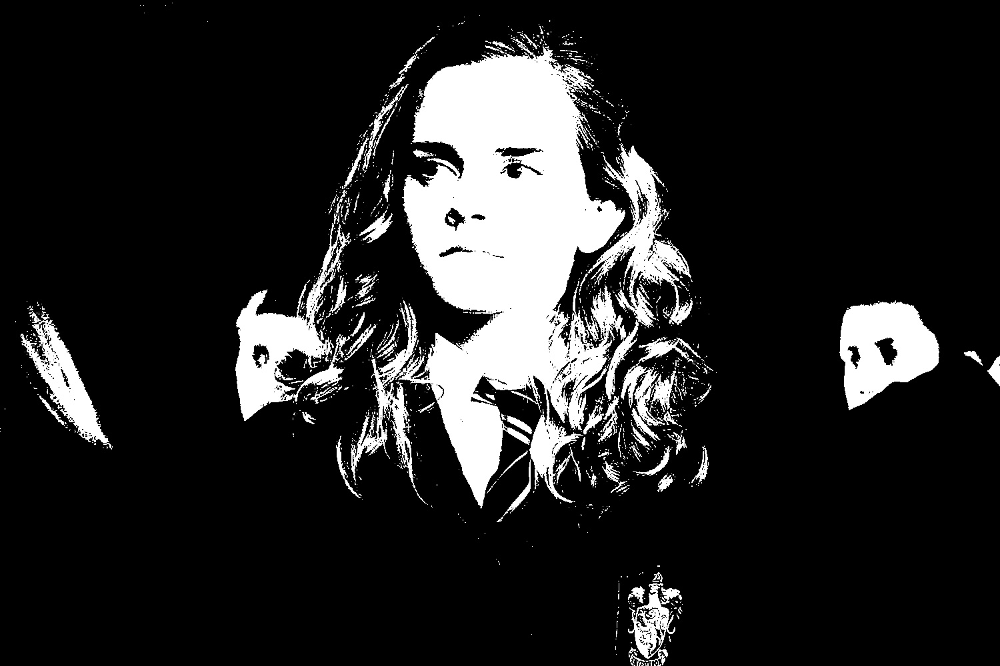

# Inter-Means Image Segmentation

This Python script implements the Inter-Means algorithm for automatic threshold-based image segmentation. It finds the optimal threshold to separate objects of interest from the background in an image.

## How It Works

1. **Initial Threshold Estimation**: The algorithm starts with an initial estimate of the threshold, often set to the average intensity of the entire image.

2. **Image Partitioning**: The image is divided into two groups, R1 and R2, using the initial threshold. Pixels in R1 have intensities less than or equal to the threshold, while R2 contains pixels with intensities greater than the threshold.

3. **Calculate Mean Values**: The mean grey values (μ1 and μ2) are calculated for the partitions R1 and R2.

4. **Threshold Adjustment**: The threshold is updated as the average of the mean values, ensuring it converges to a stable value.

5. **Iterative Refinement**: Steps 2 to 4 are repeated until μ1 and μ2 no longer significantly change in successive iterations.

## Image Comparison

### Original Image vs. Segmented Image

| Original Image | Segmented Image |
|----------------|-----------------|
|  |  |
|  |  |

The Inter-Means algorithm effectively separates the objects of interest from the background, resulting in clear and segmented images. The script saves the segmented images with filenames like `segmented_Eiffel_Tower.jpg` and `segmented_people.jpg`.

## Getting Started

1. Clone this repository.
2. Install the required libraries using 
```
pip install numpy opencv-python matplotlib
```
3. Run the script by providing your own images or use the provided examples.

## Acknowledgments

- This script is inspired by the Inter-Means thresholding algorithm used in image processing and computer vision.

